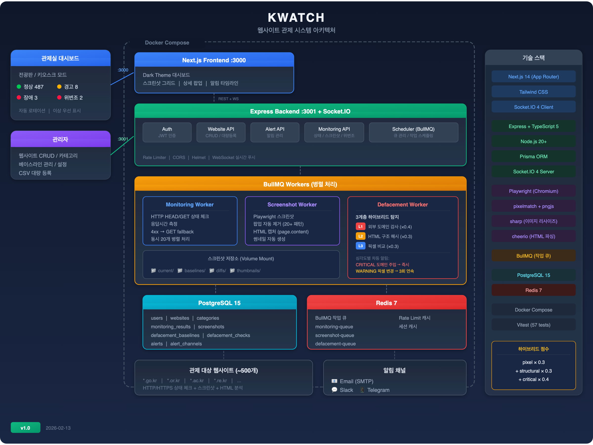

# KWATCH - 웹사이트 관제 시스템

> 사이버안전센터 웹사이트 실시간 모니터링 및 위변조 탐지 시스템

<br>

## 시스템 구성도

<p align="center">
  
</p>

<br>

## 핵심 기능

| 기능 | 설명 |
|------|------|
| **HTTP 모니터링** | 500개 웹사이트 상태코드/응답시간 실시간 체크 (HEAD → GET fallback) |
| **스크린샷 캡처** | Playwright 기반 1920x1080 스크린샷, 썸네일 자동 생성 |
| **팝업 자동 제거** | 한국 공공기관 사이트 레이어 팝업 자동 dismiss (20+ 한국어 패턴) |
| **하이브리드 위변조 탐지** | 픽셀 비교 + HTML 구조 해시 + 외부 도메인 감사 3계층 탐지 |
| **관제 대시보드** | Dark Theme, 키오스크 모드, 자동 로테이션, 이상 우선 표시 |
| **실시간 알림** | Email/Slack/Telegram + WebSocket 실시간 푸시 |
| **심각도별 알림** | 도메인 주입=즉시, 구조 변경=2회 연속, 픽셀 변경=3회 연속 |

### 하이브리드 위변조 탐지

기존 픽셀 비교만으로는 동적 사이트(동영상, 뉴스 피드 등)에서 오탐이 심각합니다.
3계층 하이브리드 탐지로 이 문제를 해결합니다:

```
 Layer 1: 외부 도메인 감사  ─── script/iframe/link src에서 새 외부 도메인 탐지  (가중치 0.4)
 Layer 2: HTML 구조 핑거프린트 ── 태그 트리 SHA-256 → 동적 콘텐츠 무관              (가중치 0.3)
 Layer 3: 픽셀 비교 (pixelmatch) ── 기존 시각적 변화 감지                          (가중치 0.3)

 종합 점수 = pixel × 0.3 + structural × 0.3 + critical × 0.4
```

**예시: 부산대학교 (동영상 메인페이지)**
```
기존(pixel only):  유사도 52% → 위변조 오탐!
개선(hybrid):      pixel=52%, structural=100%, critical=100%
                   → 종합 = 52×0.3 + 100×0.3 + 100×0.4 = 85.6% → 정상 판정
```

<br>

## 기술 스택

| 계층 | 기술 |
|------|------|
| **프론트엔드** | Next.js 14 (App Router), Tailwind CSS, Socket.IO Client |
| **백엔드** | Node.js 20+, Express, TypeScript 5 |
| **스크린샷** | Playwright (Chromium) |
| **이미지 비교** | pixelmatch + pngjs + sharp |
| **HTML 분석** | cheerio (DOM 파싱), crypto (SHA-256) |
| **데이터베이스** | PostgreSQL 15 |
| **캐시/큐** | Redis 7 + BullMQ |
| **ORM** | Prisma |
| **실시간 통신** | Socket.IO 4 |
| **컨테이너** | Docker + Docker Compose |

<br>

## 빠른 시작

### 사전 요구사항

- Docker & Docker Compose V2
- Git

### 설치 및 실행

```bash
# 1. 저장소 클론
git clone <repository-url> kwatch
cd kwatch

# 2. 환경변수 설정
cp .env.example .env
vi .env  # DB_PASSWORD, JWT_SECRET 등 실제 값 입력

# 3. Docker Compose로 실행
docker compose up -d

# 4. 서비스 확인
docker compose ps
# kwatch-db      (PostgreSQL)  :5432  healthy
# kwatch-redis   (Redis)       :6379  healthy
# kwatch-server  (Backend)     :3001  healthy
# kwatch-web     (Frontend)    :3000  healthy

# 5. 관리자 계정 생성
HASH=$(docker exec kwatch-server node -e \
  "const bcrypt = require('bcryptjs'); bcrypt.hash('비밀번호', 10).then(h => console.log(h))")
docker exec kwatch-db psql -U kwatch -d kwatch -c \
  "INSERT INTO users (username, password_hash, email, role) VALUES ('admin', '$HASH', 'admin@example.com', 'admin');"
```

| URL | 용도 |
|-----|------|
| `http://서버:3000` | 관제 대시보드 (Dark Theme) |
| `http://서버:3000/admin/settings` | 관리자 설정 |
| `http://서버:3001/api/health` | 서버 헬스체크 |

<br>

## 운영 배포

### 방법 1: Git Push 자동 배포 (권장)

개발 PC에서 `git push`만으로 운영 서버에 자동 배포합니다.

**초기 설정 (운영 서버에서 1회):**
```bash
# 운영 서버에서 setup 스크립트 실행
sudo bash scripts/setup-git-deploy.sh

# 환경변수 설정
cp /opt/kwatch/.env.example /opt/kwatch/.env
vi /opt/kwatch/.env
```

**개발 PC에서 remote 추가:**
```bash
git remote add production ssh://사용자@서버IP/opt/kwatch.git
```

**배포:**
```bash
git push production master
```

**동작 흐름:**
```
git push production master
  → bare repo post-receive hook 실행
    → 작업 디렉토리 업데이트
      → scripts/deploy.sh 실행
        → Docker 이미지 빌드
          → 컨테이너 재시작
            → Prisma migration 자동 적용
              → 헬스체크 확인
```

### 방법 2: 수동 배포

```bash
# 운영 서버에서
cd /opt/kwatch
git pull origin master
bash scripts/deploy.sh
```

### 환경변수 (.env)

```env
# === 필수 ===
DB_PASSWORD=<강력한비밀번호>
JWT_SECRET=<랜덤문자열>

# === 서버 ===
PORT=3001
NODE_ENV=production
ALLOWED_ORIGINS=http://관제실IP:3000

# === 모니터링 ===
DEFAULT_CHECK_INTERVAL=300          # 상태 체크 주기 (초)
DEFACEMENT_THRESHOLD=85             # 위변조 판정 임계값 (%)
DEFACEMENT_WEIGHT_PIXEL=0.3         # 픽셀 비교 가중치
DEFACEMENT_WEIGHT_STRUCTURAL=0.3    # 구조 비교 가중치
DEFACEMENT_WEIGHT_CRITICAL=0.4      # 도메인 감사 가중치
HTML_ANALYSIS_ENABLED=true          # HTML 분석 활성화 (false=pixel_only)

# === 알림 (선택) ===
ALERT_EMAIL_SMTP_HOST=smtp.example.com
ALERT_EMAIL_SMTP_PORT=587
ALERT_EMAIL_FROM=kwatch@example.com
ALERT_EMAIL_USER=
ALERT_EMAIL_PASS=
ALERT_SLACK_WEBHOOK_URL=https://hooks.slack.com/services/...
ALERT_TELEGRAM_BOT_TOKEN=
ALERT_TELEGRAM_CHAT_ID=

# === 대시보드 ===
DASHBOARD_AUTO_ROTATE_INTERVAL=15000  # 페이지 자동 전환 간격 (ms)
DASHBOARD_ITEMS_PER_PAGE=35           # 페이지당 사이트 수

# === 프론트엔드 ===
NEXT_PUBLIC_API_URL=http://서버IP:3001
NEXT_PUBLIC_WS_URL=ws://서버IP:3001
```

<br>

## 운영 가이드

### 관제 대시보드 (전광판)

- **키오스크 모드**: 브라우저에서 F11 전체화면 후 대시보드 접속
- **자동 로테이션**: 설정된 간격(기본 15초)으로 페이지 자동 전환
- **이상 우선 표시**: 장애/위변조 사이트가 최상단에 고정 표시
- **상태 색상**: 녹색=정상, 노란색=경고, 빨간색=장애/위변조

### 위변조 베이스라인 관리

```bash
# 특정 사이트의 최신 스크린샷을 새 베이스라인으로 설정
curl -X POST http://서버:3001/api/defacement/{websiteId}/baseline \
  -H "Authorization: Bearer {token}" \
  -H "Content-Type: application/json" \
  -d '{"screenshotId": 123}'
```

디자인 개편 등 정상적인 변경 후에는 관리자가 베이스라인을 수동 갱신해야 합니다.

### 사이트별 동적 영역 제외

동적 콘텐츠(뉴스 피드, 방문자 수 등)로 오탐이 발생하는 사이트는 CSS 셀렉터로 해당 영역을 제외합니다:

```bash
curl -X PUT http://서버:3001/api/websites/{id} \
  -H "Authorization: Bearer {token}" \
  -H "Content-Type: application/json" \
  -d '{"ignoreSelectors": [".news-ticker", "#visitor-count", ".weather-widget", "video"]}'
```

### 모니터링 확인

```bash
# 컨테이너 상태
docker compose ps

# 서버 로그 실시간 확인
docker compose logs -f server

# 특정 사이트 위변조 체크 결과 (하이브리드 점수 포함)
curl http://서버:3001/api/defacement/{websiteId}/latest

# 전체 대시보드 상태 요약
curl http://서버:3001/api/monitoring/status
```

### 데이터 보관 정책

| 데이터 | 보관 기간 |
|--------|----------|
| 모니터링 결과 | 90일 |
| 스크린샷 | 7일 (베이스라인은 영구) |
| 위변조 체크 결과 | 90일 |
| 알림 이력 | 180일 |

<br>

## 개발 환경

### 로컬 개발 실행

```bash
# macOS의 경우 Docker 런타임 시작 (Colima 사용 시)
colima start

# DB + Redis 실행
docker compose up -d db redis

# 백엔드 개발 서버
cd packages/server
cp ../../.env.example ../../.env
npx prisma db push
npm run dev

# 프론트엔드 개발 서버 (새 터미널)
cd packages/web
npm run dev
```

### 테스트

```bash
cd packages/server
npx vitest run              # 전체 테스트 (57개)
npx vitest run --coverage   # 커버리지 포함
npx tsc --noEmit            # 타입 체크
```

### 프로젝트 구조

```
kwatch/
├── docker-compose.yml          # 서비스 오케스트레이션
├── .env.example                # 환경변수 템플릿
├── scripts/
│   ├── deploy.sh               # 운영 배포 스크립트
│   └── setup-git-deploy.sh     # Git 배포 초기 설정
├── packages/
│   ├── server/                 # Express 백엔드
│   │   ├── src/
│   │   │   ├── services/
│   │   │   │   ├── MonitoringService.ts      # HTTP 상태 체크
│   │   │   │   ├── ScreenshotService.ts      # Playwright 스크린샷 + 팝업 제거
│   │   │   │   ├── DefacementService.ts      # 하이브리드 위변조 탐지
│   │   │   │   ├── HtmlAnalysisService.ts    # HTML 구조/도메인 분석
│   │   │   │   ├── AlertService.ts           # 알림 발송
│   │   │   │   └── SchedulerService.ts       # BullMQ 스케줄링
│   │   │   ├── workers/                      # BullMQ 큐 워커
│   │   │   ├── routes/                       # REST API
│   │   │   └── websocket/                    # Socket.IO
│   │   └── prisma/schema.prisma              # DB 스키마
│   └── web/                    # Next.js 프론트엔드
│       └── src/
│           ├── app/(dashboard)/              # 관제 대시보드
│           ├── app/(admin)/                  # 관리 화면
│           └── components/dashboard/         # 대시보드 컴포넌트
└── docs/                       # 프로젝트 문서
```

<br>

## 라이선스

Private - 내부 사용 전용
